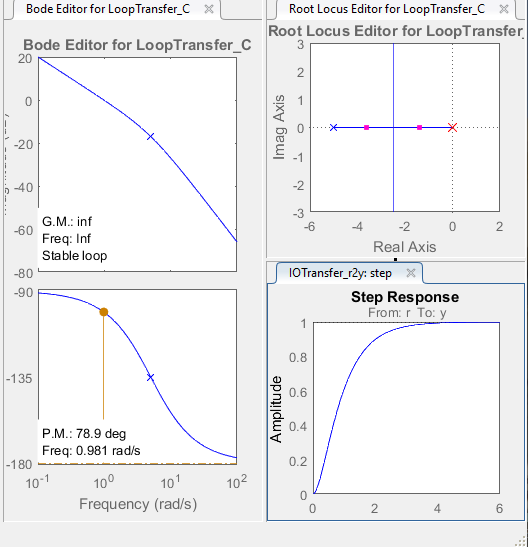
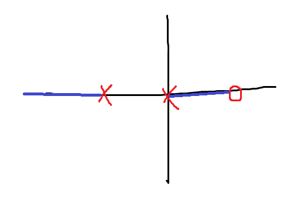
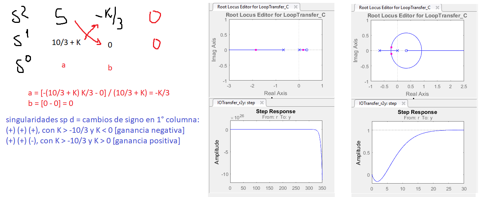

A no decaer!

## Error y Seguimiento
Ver minuto 11 para diferencia entre error de estado estacionario y error de seguimiento

## LdR
Muestra como cambia la ubicación de los polos según la ganancia K elegida (a lazo cerrado).

Para encontrar los puntos de fuga (PF), despejo K y la derivo respecto a "s". Descarto los resultados complejos y los que no me den en los tramos de lugar de raíces.

Mediante Routh puedo encontrar la ganancia K donde el sistema pasa a ser inestable (Kc), a partir de la cantidad de cambios de signos que se pueden dar en la primera columna.

Si reemplazo K=Kc en la ec. característica, encontraremos raíces imaginarias puras (valores de frontera).

## MatLab
```sisotool``` para entrar al Control System Bode Editor

### Sisotool
Se puede ver el diagrama de bloques mediante Edit Architecture.

Ejemplo (escribir en workspace): 
```
G = tf(1, [1 5]);
s = tf('s');
C = 5/s;          % integrador
```

Para cargarlo debo ingresar a Edit Architecture > Import



En el Root Locus Editor puedo modificar los polos simplemente arrastrándolos. Luego, mediante "Export", puedo obtener el nuevo valor de C en el workspace de MatLab.

Manos a la obra...

### Ejercicio 1d)

Cuando la tf tiene productos de (s+a) sirve para LDR, y cuando son (as+b) sirve para Bode.

```
G = K (3s - 1) / 10s (1,5s + 1) 
G = 3K (s - 1/3) / 15s (s + 2/3)
G = K (s - 1/3) / 5s (s + 2/3)
```

Polos en origen y s = -2/3, cero en 1/3, entonces n - m = 1



Calculando el ángulo de la asíntota: +-180° (es 1 sola)
* Entonces el cero del infinito está en menos infinito.

Calculando Routh... 
```
1 + CGH = 0
1 + G = 0
5s (s+2/3) + K (s - 1/3) = 0       % el denominador voló...
5 s^2 + (10/3 + K) s - K/3 = 0
```



## Clase 26 de Junio
Dentro del sisotool, si hago click derecho sobre la respuesta temporal (Step Response) > Characteristics, puedo conocer el sobrepico y el tiempo de establecimiento si los polos son complejos conjugados.


